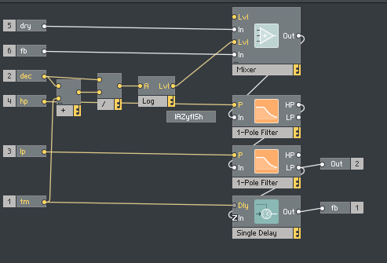
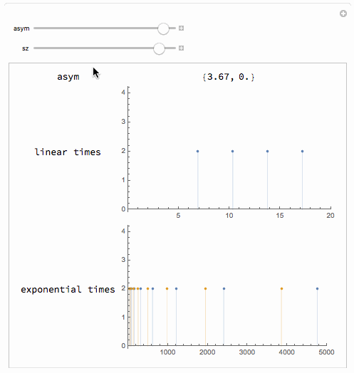

I have been porting the [h e i s h e r e](https://www.native-instruments.com/en/reaktor-community/reaktor-user-library/entry/show/2435/)
reverb to [Reaktor Blocks](https://www.native-instruments.com/en/products/komplete/synths/reaktor-6/blocks/).
Reaktor Blocks and Reaktor Core are a fantastic playground to explore DSP algorithms, and h e i s h e r e is an amazing ensemble
by Lazyfish. It consists of a crazy sound engine, fed into a simple yet great sounding reverb.
It is implemented in Reaktor Primary (it was actually built in Reaktor 2), but I wanted to port it to Reaktor Core,
as Blocks are all implemented in Core.

The basic structure is fairly simple, a sound engine (who is) is fed into an effects processor (it? he is), and finally ends up
in the reverb (here?).


The structure of the reverb looks like this:


It consists of a few parameter computation macros (Reflections and Room),
two feedback structures (for the left and right channel), and finally a
level macro used to compress and adjust the level of the output.

While the parameter and level macros are mono, the actual reverb is polyphonic,
which is a common pattern in lazyfish ensembles.
The 8-voice polyphony of the reverb modules is used to create 8 parallel delay lines,
that crossfeed into each other. This is the structure of the reverb macro:



The input is mixed with the attenuated feedback level, fed into a bandpass filter
(built as a HP in series with a LP filter), and finally delayed by a simple delay line.
This is a common structure for the modelling of late reverberation (also called diffuse reverberation).


The delay lengths are chosen to be exponentially spaced to achieve a dense reverberation pattern.
Let's look at how these delay lengths are computed:


The SizE inpt is squared, and fed into a macro that spaces it out linearly.
It is worth noting that the times start at twice the size, so that there is a slight effect
of early reflection, since the first delay will be moving away from 0 as size gets bigger.
This is a slightly untangled view into the "+ to voice" macro.


The asymmetry module can add a constant delay to either the left or right channel, depending
on the polarity of the aSym knob.


Finally, the linearly (and spatially slightly offset) delay times are fed into an exponential.
Looking at the computation in Mathematica allows us to see what is going on a bit better:

```
computeAsym[aSym_] :=
  {aSym*If[Not[-aSym > 0], 1., 0.],
   aSym*If[Not[-aSym > 0], 0., 1.]};

pitchToFrequency[pitch_] :=
  440. (2^((pitch - 69)/12));

computePitchTable[dst_, sz_] :=
  Table[dst + sz*i, {i, 1, 8}];

computeFreqTables[size_, asym_] :=

 Module[{asym2 = computeAsym[asym],
   table = computePitchTable[size^2, size^2]},
  {pitchToFrequency /@ (table + asym2[[1]]),
   pitchToFrequency /@ table + asym2[[2]]}]

Manipulate[
 Module[{asym2 = computeAsym[asym]},
  Grid[{
    {"asym", asym2},
    {"linear times",
     ListPlot[{#, 2} & /@ computePitchTable[sz^2, sz^2],
      Filling -> Axis, PlotRange -> {{0, 20}, Automatic},
      ImageSize -> 300]},
    {"exponential times",
     ListPlot[Map[{#, 2} &, computeFreqTables[sz^2, asym], {2}],
      Filling -> Axis, PlotRange -> {{0, 5000}, Automatic},
      ImageSize -> 300]}

    }]],
 {asym, -4, 4},
 {sz, 0, 2}]
```


